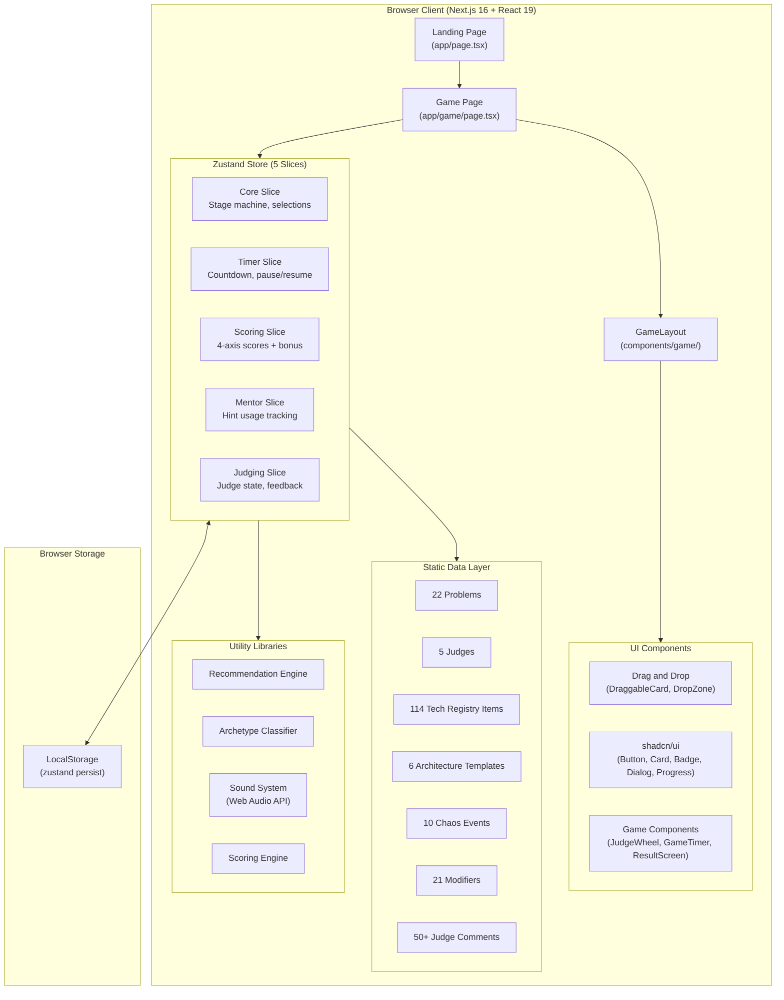
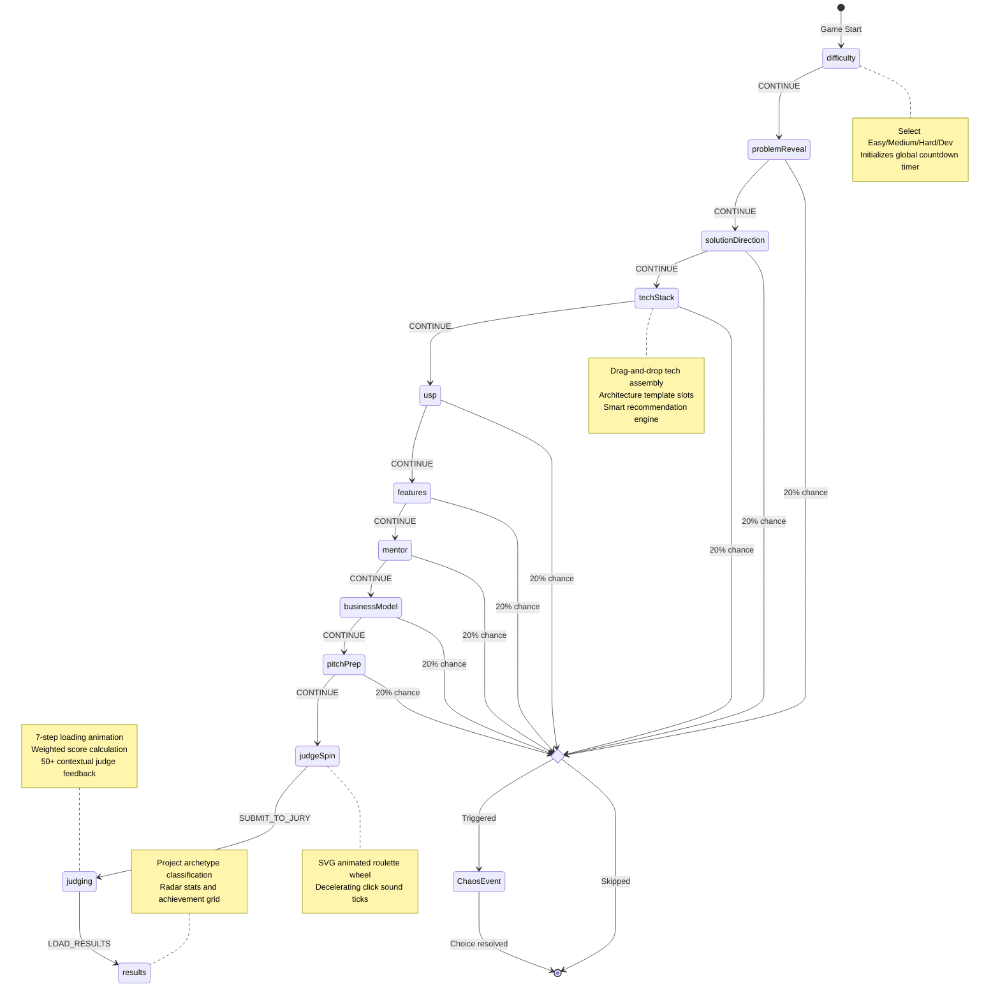
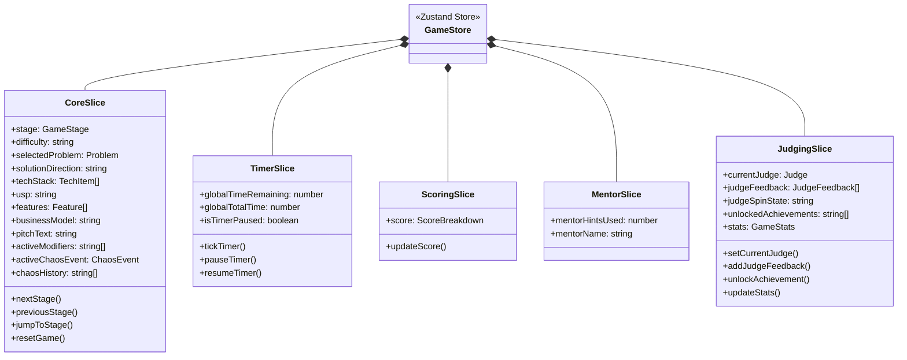
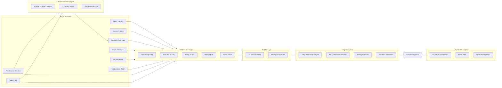

<div align="center">

# THE HACKATHON SIMULATOR

### Build. Ship. Survive.

*A gamified, turn-based hackathon experience, from problem reveal to final judging, built entirely in the browser.*

[](https://nextjs.org/)
[](https://react.dev/)
[](https://typescriptlang.org/)
[](https://zustand-demo.pmnd.rs/)
[](https://www.framer.com/motion/)
[](https://opensource.org/licenses/MIT)

<br/>

> Ever wondered what it feels like to compete in a hackathon without leaving your desk?
>
> The Hackathon Simulator drops you into a timed, pressure-cooker scenario where every decision, from your tech stack to your elevator pitch, determines whether you walk away with the trophy or crash at compile time.

<br/>

[**Play Now**](#getting-started) · [**Documentation**](#architecture) · [**Report Bug**](https://github.com/udaysharmadev/The-Hackathon-Simulator/issues) · [**Request Feature**](https://github.com/udaysharmadev/The-Hackathon-Simulator/issues)

</div>

---

## Table of Contents

- [Overview](#overview)
- [Key Features](#key-features)
- [Architecture](#architecture)
  - [High-Level Architecture](#high-level-architecture)
  - [Game Stage Pipeline](#game-stage-pipeline)
  - [State Management (Zustand Store)](#state-management-zustand-store)
  - [Data Flow](#data-flow)
- [Game Mechanics Deep Dive](#game-mechanics-deep-dive)
  - [12-Stage Game Pipeline](#12-stage-game-pipeline)
  - [Tech Recommendation Engine](#tech-recommendation-engine)
  - [Architecture Templates](#architecture-templates)
  - [Scoring Engine](#scoring-engine)
  - [Chaos Engine](#chaos-engine)
  - [Judge Evaluation Engine](#judge-evaluation-engine)
  - [Contextual Judge Comments](#contextual-judge-comments)
  - [Project Archetype Classifier](#project-archetype-classifier)
  - [Modifier System](#modifier-system)
  - [Achievement System](#achievement-system)
  - [Sound System](#sound-system)
- [Tech Stack](#tech-stack)
- [Project Structure](#project-structure)
- [Getting Started](#getting-started)
- [Data Models](#data-models)
- [Contributing](#contributing)
- [Development Roadmap](#development-roadmap)
- [License](#license)

---

## Overview

The Hackathon Simulator is a single-player, turn-based strategy simulation built with Next.js 16, React 19, and Zustand 5. It faithfully recreates the entire lifecycle of a hackathon: selecting a difficulty level, receiving a randomized problem statement, assembling a technology stack with intelligent recommendations, prioritizing features, consulting a mentor, preparing your pitch, and finally defending your project before a specialist judge.

The core experience is a focused 10-minute simulation. You choose your difficulty (Easy, Medium, Hard, or Dev) and a global countdown timer begins ticking immediately. Every decision you make silently adjusts hidden scores across four categories. At the end, a randomly selected judge evaluates your entire run and delivers personalized, context-aware feedback based on every choice you made.

### What Makes It Unique

| Aspect | Description |
|--------|-------------|
| **114 Technologies** | Massive curated tech registry spanning 17 categories with synergies and conflicts |
| **Smart Recommendations** | AI-aware recommendation engine suggesting optimal stacks based on your solution direction and USP |
| **Architecture Templates** | 6 solution-specific slot-based architecture blueprints guiding your tech assembly |
| **50+ Judge Voices** | Contextual, personality-driven feedback that adapts to your exact stack, USP, and business model |
| **6 Project Archetypes** | Post-game classification into archetypes like The Overengineer, The Hustler, or The Minimalist |
| **10 Chaos Events** | Realistic weighted incidents that interrupt gameplay with meaningful tradeoffs |
| **Hidden Scoring** | 4-axis scoring matrix (Innovation, Execution, Design, Pitch) with hidden synergy bonuses |
| **Synthesized Audio** | Web Audio API sound effects with zero external audio assets |
| **Persistent Stats** | LocalStorage-backed historical performance tracking across sessions |

---

## Key Features

### Strategic Decision Making
- **6 Solution Directions**: Web App, Mobile App, AI Solution, IoT Hardware, Service Platform, Marketplace
- **114 technologies** organized into **17 categories** with drag-and-drop stack assembly
- **Smart tech recommendations** that adapt to your chosen solution direction, USP, and problem category
- **Architecture templates** with required, recommended, and optional slot guidance per solution type
- **7 USP Options** with hidden score tradeoffs
- **10 Backlog Features** with 3-bucket prioritization (Must-Have, Nice-to-Have, Overkill)
- **7 Business Models** with contextual alignment bonuses

### Dynamic Systems
- **Mentor Advisor**: Context-aware feedback analyzing your stack, scoping, and alignment
- **10 Chaos Events**: Weighted, categorized (Technical, Team, Lucky, Judge) with binary choice resolution
- **21 Game Modifiers**: Rule-changing conditions that alter scoring during judging
- **5 Judge Personalities**: Each with unique scoring weights, expertise areas, and 50+ contextual feedback templates
- **6 Project Archetypes**: Post-game personality classification based on your decisions

### Realism Pass (v1.2)
- Contextual judge feedback that references your specific tech choices, USP, and business model
- Architecture-aware tech stack assembly with slot-based templates
- Project archetype classification with radar stats on the results dashboard
- Streamlined 10-minute simulation focused on depth over breadth

---

## Architecture

### High-Level Architecture



### Game Stage Pipeline

The simulator operates as a linear state machine with 12 sequential stages. The player progresses forward (and can navigate backward) through each stage, with chaos events potentially interrupting between transitions.



### State Management (Zustand Store)

The game state is managed by a single Zustand store composed of 5 logical slices, enhanced with `devtools` and `persist` middleware.



#### Persistence Strategy

The store uses Zustand's `persist` middleware with a custom `partialize` function that selectively saves only essential cross-session data:

| Persisted | Not Persisted |
|-----------|---------------|
| `unlockedAchievements` | `stage`, `phase` |
| `stats` (historical runs) | `score` (current run) |
| `soundEnabled` | `techStack`, `features` |
| | `activeChaosEvent` |
| | `globalTimeRemaining` |

Storage key: `hackathon-simulator-sprint2-persist`

### Data Flow



---

## Game Mechanics Deep Dive

### 12-Stage Game Pipeline

| # | Stage | Key | Description | Player Action |
|---|-------|-----|-------------|--------------|
| 01 | **Difficulty** | `difficulty` | Set compilation budget and time | Select Easy (10m) / Medium (7m) / Hard (5m) / Dev (60s) |
| 02 | **Problem Reveal** | `problemReveal` | Randomized startup challenge | Review or shuffle for a new problem statement |
| 03 | **Solution Direction** | `solutionDirection` | Choose architecture layout | Select from 6 project types (Web, Mobile, AI, IoT, Platform, Marketplace) |
| 04 | **Tech Stack** | `techStack` | Assemble technology pipeline | Drag-and-drop from 114 techs into architecture template slots |
| 05 | **USP** | `usp` | Define competitive advantage | Choose from 7 USP profiles with hidden tradeoffs |
| 06 | **Features** | `features` | Backlog prioritization | Categorize 10 features into Must/Nice/Overkill buckets |
| 07 | **Mentor** | `mentor` | Consult advisor | Run one-time mentor audit (context-aware feedback) |
| 08 | **Business Model** | `businessModel` | Set revenue strategy | Select from 7 monetization models |
| 09 | **Pitch Prep** | `pitchPrep` | Compile elevator pitch | Review manifest, edit pitch text, review talking points |
| 10 | **Judge Spin** | `judgeSpin` | Jury selector roulette | Spin SVG wheel to randomly select a judge |
| 11 | **Judging** | `judging` | Evaluation pipeline | Watch 7-step compiler animation, receive score |
| 12 | **Results** | `results` | Final dashboard | View archetype, scores, achievements, strengths/weaknesses, share card |

---

### Tech Recommendation Engine

The recommendation engine (`lib/recommendations.ts`) generates intelligent stack suggestions based on three inputs: your chosen **solution direction**, your selected **USP**, and the **problem category**. It produces a curated list of 3 to 5 technology IDs along with a natural-language explanation of why they fit together.

#### How It Works

The engine maps **6 solution directions x 7 USPs = 42 unique combinations**, each returning a hand-tuned recommendation. For example:

| Solution | USP | Recommended Stack | Reasoning |
|----------|-----|-------------------|-----------|
| Web App | Fastest | Next.js, Vercel, Supabase, Tailwind | SSR + edge caching + real-time Postgres |
| Web App | AI-powered | Next.js, Vercel, OpenAI, Pinecone | API routes + vector RAG pipeline |
| Mobile App | Cheapest | Flutter, SQLite, Figma | Local storage, zero cloud costs |
| AI Solution | Most Scalable | FastAPI, Claude, AWS, Weaviate | Enterprise vector clustering at scale |
| IoT Product | AI-powered | Raspberry Pi, TF Lite, OpenCV | Edge ML with real-time computer vision |
| Marketplace | Community-first | Next.js, Socket.io, Stripe, PostgreSQL | Real-time negotiations + secure escrow |

The engine also appends domain-specific reasoning based on the problem category (EdTech, HealthTech, FinTech, Sustainability, AI, Smart Campus, Social Impact), providing guidance like "Optimized for classroom metrics and distributed pupil response routing" for EdTech problems.

#### In-Game Display

The recommendation appears as a highlighted panel in the Tech Stack stage, showing the suggested technologies with a "RECOMMENDED" badge. Players can filter the tech pool to show only recommended items or browse all 114 technologies freely.

---

### Architecture Templates

Each of the 6 solution directions has a dedicated architecture template (`data/architectureTemplates.ts`) that defines a structured set of slots the player should fill. Slots have three priority levels:

| Priority | Meaning | Score Impact |
|----------|---------|-------------|
| **Required** | Core infrastructure that must be filled | Missing slots heavily penalize execution |
| **Recommended** | Important additions for a polished product | +5 Innovation per populated recommended slot |
| **Optional** | Nice-to-have integrations | Bonus points for strategic additions |

#### Template Slot Breakdown

| Solution | Required Slots | Recommended Slots | Optional Slots | Total |
|----------|---------------|-------------------|----------------|-------|
| **Web Application** | Frontend, Backend, Database, Hosting | Auth | Payments, Realtime, AI, Analytics | 9 |
| **Mobile Application** | Mobile Framework, Server API, App Storage, Deployment | Auth | Notifications, Hardware, Payments, AI, Analytics | 10 |
| **AI Solution** | Neural AI Model, Inference Backend, API Gateway, Hosting | -- | Vector DB, UI, Semantic Memory, Observability, Data Pipeline | 9 |
| **IoT Hardware** | Microcontroller, Mesh Connectivity, Firmware Runtime | Sensors, CAD | Cloud Backend, Dashboard, Edge ML, Power, Storage | 10 |
| **Trading Marketplace** | Buyer Frontend, Escrow Backend, Ledger, Payments, Hosting | Auth | Geo Discovery, Chat, Matchmaker, Analytics | 10 |
| **Service Platform** | Console Portal, API Core, Multi-tenant DB, Billing, Hosting | SSO/IAM | Admin, Analytics, Automation, Monitoring | 10 |

Each slot specifies which tech categories are compatible (for example, the "Frontend Layout" slot accepts items from the Frontend and Design/UI categories), guiding players toward coherent architectural decisions.

---

### Scoring Engine

The simulator uses a hidden 4-axis scoring system where every player decision silently adjusts internal score values. Players never see their raw scores until the final evaluation.

#### Score Categories

| Category | Range | What It Measures |
|----------|-------|------------------|
| **Innovation** | 0 to 100 | Novelty of solution, tech choices, USP alignment |
| **Execution** | 0 to 100 | Implementation quality, scoping discipline, stack feasibility |
| **Design** | 0 to 100 | UI/UX quality, polish, visual considerations |
| **Pitch** | 0 to 100 | Presentation quality, business model fit, strategic alignment |
| **Bonus** | 0+ | Extra points from synergies, modifiers, and special conditions |

#### Tech Scoring Weights

Every technology in the registry carries hidden scoring weights. For example:

| Technology | Innovation | Execution | Design | Pitch |
|-----------|-----------|-----------|--------|-------|
| Next.js | 10 | 15 | 12 | 10 |
| OpenAI API | 25 | 10 | 5 | 20 |
| Gemini API | 25 | 10 | 5 | 20 |
| Vercel | 8 | 20 | 10 | 10 |
| ESP32 | 20 | 10 | 5 | 15 |
| SQLite | 0 | 18 | 5 | 2 |
| Stripe Checkout | 8 | 20 | 12 | 12 |

#### Synergies and Conflicts

Technologies define explicit synergy and conflict relationships:

- **Synergies**: Combining synergistic techs (like Next.js + Vercel, or ESP32 + MQTT + BLE) triggers hidden bonus multipliers
- **Conflicts**: Incompatible combinations (like Arduino + Vercel, or Spring Boot + ESP32) are flagged and may reduce scores

---

### Chaos Engine

The Chaos Engine introduces unpredictable events that interrupt gameplay between stage transitions. Each event presents a binary choice with meaningful tradeoffs affecting scores and the countdown timer.

#### Event Categories (10 Total)

| Category | Count | Nature |
|----------|-------|--------|
| **Technical** | 3 events | API rate limits, database crashes, keyboard spills |
| **Team** | 3 events | Teammate disappearance, last-minute pivots, mentor unavailability |
| **Lucky** | 2 events | Sponsor API access, surprise coffee deliveries |
| **Judge** | 2 events | Last-minute jury mandate changes (sustainability, pitch time limits) |

#### Trigger Probability

Events have a **20% chance** of triggering on each stage transition. Previously triggered events are excluded from the pool to prevent repeats.

#### Event Selection Algorithm

Events are selected using a weighted random algorithm. Each event carries a `weight` value (ranging from 8 to 10) that influences selection probability:

```typescript
function getRandomChaosEvent(excludeIds: string[]): ChaosEvent {
  const available = CHAOS_EVENTS.filter(e => !excludeIds.includes(e.id));
  const totalWeight = available.reduce((acc, e) => acc + e.weight, 0);
  let roll = Math.random() * totalWeight;

  for (const event of available) {
    roll -= event.weight;
    if (roll <= 0) return event;
  }
}
```

#### Example Event: "Last-Minute Pivot"

```
+-------------------------------------------+
| CRITICAL HACKATHON INCIDENT DETECTED       |
+-------------------------------------------+
| EVENT: Last-Minute Pivot                   |
| CATEGORY: [TEAM]                           |
|                                            |
| Your teammate pitches a brilliant new      |
| application pivot direction. Implementing  |
| it requires discarding key backlog         |
| features.                                  |
|                                            |
| CHOICE A: Execute Pivot                    |
|   Innovation +25, Execution -20,           |
|   Design -10                               |
|                                            |
| CHOICE B: Stay Focused                     |
|   Execution +15, Innovation -5,            |
|   Time remaining +15s                      |
+-------------------------------------------+
```

---

### Judge Evaluation Engine

The judging system uses a weighted scoring formula based on the selected judge's personality-driven category weights.

#### Judge Profiles

| Judge | Personality | Innovation | Execution | Design | Pitch |
|-------|------------|-----------|-----------|--------|-------|
| Dr. Priya Kapoor (CTO) | Technical | 20% | **45%** | 10% | 25% |
| Alex Nakamura (CEO) | Creative | **35%** | 15% | 20% | 30% |
| Marcus Rivera (Design Head) | Encouraging | 15% | 15% | **45%** | 25% |
| Victoria Chen (VC Partner) | Tough | 20% | 30% | 15% | **35%** |
| Lord Bugsworth (Dean of Chaos) | Tough | 25% | 25% | 25% | 25% |

Lord Bugsworth applies an additional random offset, making his evaluations unpredictable.

#### Score Calculation Formula

```
weighted_score = (Innovation x W_innovation) + (Execution x W_execution)
               + (Design x W_design) + (Pitch x W_pitch)

final_score = weighted_score + bonus_points
              +/- (random offset if Lord Bugsworth)

CLAMPED to [0, 100]
```

#### Grade Thresholds

| Grade | Score Range | Verdict |
|-------|-----------|---------|
| **S** | 94 and above | Project Approved |
| **A** | 84 to 93 | Project Approved |
| **B** | 72 to 83 | Project Approved |
| **C** | 60 to 71 | Project Approved |
| **D** | 48 to 59 | Compile Failed |
| **F** | Below 48 | Compile Failed |

---

### Contextual Judge Comments

The judge feedback system (`data/judgeComments.ts`) contains **50+ unique, highly contextual comment templates** that adapt to the player's exact project state. Instead of generic praise or criticism, each judge references specific technologies, USP choices, business models, and feature scoping decisions.

#### How Context Drives Feedback

The comment generator inspects the full game state and produces targeted feedback:

| Judge | Score Tier | Context | Example Feedback |
|-------|-----------|---------|-----------------|
| Dr. Priya Kapoor | High (90+) | Next.js + Supabase in stack | "Superb architectural design. Coupling Next.js routes with Supabase row-level security handles data transactions flawlessly." |
| Dr. Priya Kapoor | Mid (70-89) | Overengineered stack | "A solid MVP, but the tech stack is slightly bloated. Did you really need Docker and AWS to host a static page?" |
| Alex Nakamura | Low (<70) | AI USP but no AI tech | "Startup heresy! Your pitch deck promises a revolutionary AI-powered solution, yet you didn't include a single AI framework." |
| Victoria Chen | High (90+) | B2B SaaS + Scalable USP | "Outstanding venture prospects. Enterprise SaaS recurring fees with a scalable AI backend creates an exceptionally defensible moat." |
| Lord Bugsworth | Low (<70) | Node + MongoDB | "ERROR 404: ARCHITECTURE NOT FOUND. The Node server is throwing undefined logs while your MongoDB cluster emits actual digital smoke." |

The system evaluates conditions like:
- Which specific technologies are in the stack
- Whether the player is overengineered (4+ techs, 4+ features) or minimalist (2 features, 3 or fewer techs)
- Whether AI technologies match AI-related USP claims
- Whether business models align with solution directions
- Whether hardware was selected for IoT projects

---

### Project Archetype Classifier

At the end of each run, the archetype classifier (`lib/archetypes.ts`) analyzes your decisions and assigns one of **6 distinct project archetypes**. Each archetype includes a name, subtitle, detailed personality description, and a radar chart with four metrics.

#### Archetype Reference

| Archetype | Trigger Conditions | Radar Profile |
|-----------|-------------------|---------------|
| **The Overengineer** | 4+ stack items or Docker + AWS combo | Tech Depth: 95%, Business: 20%, Design: 50%, Scrappiness: 15% |
| **The Minimalist** | 2 or fewer features and 3 or fewer stack items | Tech Depth: 40%, Business: 60%, Design: 90%, Scrappiness: 80% |
| **The Hacker** | "Fastest" USP selected | Tech Depth: 55%, Business: 45%, Design: 30%, Scrappiness: 98% |
| **The Hustler** | B2B SaaS or Marketplace model, or "Cheapest" USP | Tech Depth: 35%, Business: 95%, Design: 60%, Scrappiness: 70% |
| **The Visionary** | AI-powered, Sustainable, or Community-first USP | Tech Depth: 70%, Business: 75%, Design: 85%, Scrappiness: 50% |
| **The Builder** | Balanced decisions (default fallback) | Tech Depth: 75%, Business: 70%, Design: 70%, Scrappiness: 75% |

Each archetype comes with a witty, detailed description. For example, The Overengineer gets: *"You spent the hackathon setting up Docker containers, PostgreSQL connection pools, and AWS auto-scaling lattices. The project's architecture is enterprise-ready and Dr. Priya Kapoor is weeping with joy, but the actual app is essentially a beautiful loading spinner and a single login button."*

---

### Modifier System

Modifiers are rule-changing conditions that alter scoring during the final jury evaluation. They apply penalties or bonuses based on the player's choices throughout the run.

#### Modifier Reference (21 Modifiers)

| ID | Name | Effect |
|----|------|--------|
| `NO_AI_TOOLS` | No AI Tools | -25 Innovation if AI tech/USP used |
| `BOOTSTRAP_ONLY` | Bootstrap Only | -20 Execution if AWS/PostgreSQL used |
| `MOBILE_ONLY` | Mobile Only | -25 Execution if non-mobile direction |
| `WEB_ONLY` | Web Only | -25 Execution if non-web direction |
| `AI_ONLY` | AI Only | -25 Execution if non-AI direction |
| `LIMITED_BUDGET` | Limited Budget | -15 Execution base penalty |
| `GREEN_FIRST` | Green First | +15 Bonus if Sustainable USP or Gov model |
| `USER_SENSITIVE` | User Sensitive | +15 Design if score is 80+, else -25 Design |
| `TECH_WIZARD` | Tech Wizard | Double synergy bonus points |
| `SOLO_DEV` | Solo Dev | Lucky break time bonuses disabled |
| `FAST_SHIP` | Fast Ship | -20 Execution if more than 2 must-have features |
| `NO_MENTOR` | No Mentor | -30 Pitch if mentor was consulted |
| `OPEN_SOURCE` | Open Source | -15 Innovation penalty |
| `MONETIZE_NOW` | Monetize Now | -20 Pitch if Freemium/Ads model |
| `CHAOS_MAGNET` | Chaos Magnet | Elevated chaos event probability |
| `SECURITY_FIRST` | Security First | -20 Execution if no Supabase/PostgreSQL |
| `MINIMALIST` | Minimalist | -15 Design if features count is not 2 |
| `CLOUD_NATIVE` | Cloud Native | -15 Innovation if no Vercel/AWS |
| `ACCESSIBILITY_MANDATE` | Accessibility Mandate | -15 Design baseline penalty |
| `HARDCORE_JUDGE` | Hardcore Judge | 0.85x final score multiplier |
| `PIVOT_FRIENDLY` | Pivot Friendly | Pivot events yield enhanced bonuses |

---

### Achievement System

The simulator tracks **13 persistent achievements** that unlock based on specific gameplay conditions. Achievements persist across sessions via LocalStorage.

| Achievement | Unlock Condition |
|------------|-----------------|
| Scope Master | Must-Have features count equals 2 or 3 |
| Startup Brain | Business model matches problem category |
| Technical Wizard | Activate 2 or more stack synergies |
| Judge Favorite | Earn score of 90 or above |
| Speed Builder | Choose "Fastest" USP |
| AI Pioneer | Combine AI models with AI USP |
| Chaos Survivor | Face 2 or more negative events and survive |
| Frugal Founder | Freemium model + Cheapest USP |
| Lean and Mean | 2 features, 3 or fewer stack items |
| Omniscient | Used the mentor advisor |
| Crisis Manager | Resolve 2 or more negative events and score 80+ |
| Lucky Builder | Face 1 or more lucky breaks and score 85+ |
| Pivot Master | Execute a last-minute project pivot |

---

### Sound System

The simulator features a fully synthesized audio system built on the Web Audio API. No external audio files are used. All sounds are generated programmatically in real-time.

| Sound Effect | Trigger | Technique |
|-------------|---------|-----------|
| `playMutedClick()` | Button clicks | Sine wave 800 to 120Hz in 40ms |
| `playSubtleHover()` | Element hover | 1400Hz sine, 15ms duration |
| `playSnapSound()` | Drag-drop success | Double tick at 400Hz + 600Hz |
| `playWarningTick()` | Timer warning (under 60s) | 380Hz sine, 120ms decay |
| `playWheelSpinClick()` | Judge wheel rotation | 1000Hz triangle wave, 10ms |
| `playScoreChord()` | Score reveal | C major 7th chord (C4-E4-G4-B4) |
| `playUnlockArpeggio()` | Achievement unlock | Ascending arpeggio (C4 to C5) |

Sound can be toggled on or off globally via the Zustand store.

---

## Tech Stack

| Layer | Technology | Version | Purpose |
|-------|-----------|---------|---------|
| **Framework** | [Next.js](https://nextjs.org/) | 16.2.6 | React meta-framework with App Router |
| **UI Library** | [React](https://react.dev/) | 19.2.4 | Component rendering engine |
| **Language** | [TypeScript](https://typescriptlang.org/) | 5.x | Static type safety |
| **State** | [Zustand](https://zustand-demo.pmnd.rs/) | 5.0.14 | Lightweight state management with middleware |
| **Animation** | [Framer Motion](https://www.framer.com/motion/) | 12.40.0 | Layout animations, page transitions, spring physics |
| **Drag and Drop** | [@dnd-kit](https://dndkit.com/) | 6.3.1 | Accessible drag-and-drop for tech stack and features |
| **Styling** | [Tailwind CSS](https://tailwindcss.com/) | 4.x | Utility-first CSS framework |
| **Icons** | [Lucide React](https://lucide.dev/) | 1.17.0 | Consistent icon system |
| **Components** | [shadcn/ui](https://ui.shadcn.com/) | 4.8.3 | Accessible, composable UI primitives |
| **Fonts** | [Inter](https://rsms.me/inter/) + [JetBrains Mono](https://www.jetbrains.com/lp/mono/) | Latest | Sans-serif body + monospace terminal text |
| **Audio** | Web Audio API | Native | Synthesized sound effects (no audio files) |
| **Storage** | LocalStorage | Native | Persistent achievements and historical stats |

---

## Project Structure

```
The-Hackathon-Simulator/
|
+-- app/                              # Next.js App Router pages
|   +-- layout.tsx                    # Root layout (fonts, metadata, SEO)
|   +-- page.tsx                      # Landing page (single-mode launch)
|   +-- globals.css                   # Global styles + Paper Terminal design tokens
|   +-- game/
|       +-- page.tsx                  # Main game orchestrator (3,004 lines)
|                                     #   Includes all 12 stage components,
|                                     #   ChaosEventOverlay, DevDebugPanel,
|                                     #   architecture template rendering,
|                                     #   recommendation display, and
|                                     #   archetype classification on results
|
+-- components/
|   +-- drag-drop/                    # Drag-and-drop system
|   |   +-- DraggableCard.tsx         # Draggable wrapper component
|   |   +-- DropZone.tsx              # Drop target container
|   |   +-- TechStackDnD.tsx          # Tech stack DnD implementation
|   |   +-- FeaturePriorityDnD.tsx    # Feature prioritization DnD
|   +-- game/                         # Game-specific components
|   |   +-- GameLayout.tsx            # Persistent game chrome/layout
|   |   +-- GameTimer.tsx             # Countdown timer display
|   |   +-- JudgeWheel.tsx            # SVG spinning wheel
|   |   +-- ProblemReveal.tsx         # Problem statement card
|   |   +-- DecisionCard.tsx          # Generic decision option card
|   |   +-- ResultScreen.tsx          # Results dashboard component
|   +-- ui/                           # shadcn/ui primitives
|       +-- button.tsx
|       +-- card.tsx
|       +-- badge.tsx
|       +-- dialog.tsx
|       +-- progress.tsx
|       +-- separator.tsx
|
+-- data/                             # Static game data (curated content)
|   +-- problems.ts                   # 22 hackathon problems (7 categories)
|   +-- judges.ts                     # 5 judge profiles with scoring weights
|   +-- techItems.ts                  # 15 legacy tech items + hidden score weights
|   +-- techRegistry.ts              # 114 modern tech items (17 categories)
|   +-- architectureTemplates.ts     # 6 solution-specific slot templates
|   +-- chaosEvents.ts               # 10 chaos events (4 categories)
|   +-- modifiers.ts                  # 21 game modifiers
|   +-- judgeComments.ts             # 50+ contextual judge feedback templates
|   +-- mentorHints.ts               # Context-aware mentor feedback data
|
+-- lib/                              # Utility libraries
|   +-- recommendations.ts           # Smart tech stack recommendation engine
|   +-- archetypes.ts                # Project archetype classifier (6 types)
|   +-- dailyChallenge.ts            # Seeded PRNG + daily challenge generator
|   +-- sound.ts                      # Web Audio API synthesized sound system
|   +-- scoring.ts                    # Score calculation utilities
|   +-- randomizer.ts                # Weighted random selection helpers
|   +-- utils.ts                      # General utility functions (cn)
|
+-- store/
|   +-- gameStore.ts                  # Zustand store (5 slices, persist, devtools)
|
+-- types/
|   +-- game.ts                       # Core TypeScript type definitions
|
+-- package.json                      # Dependencies and scripts
+-- tsconfig.json                     # TypeScript configuration
+-- next.config.ts                    # Next.js configuration
+-- tailwind.config.ts                # Tailwind CSS configuration
```

---

## Getting Started

### Prerequisites

- **Node.js** version 18 or higher
- **npm** version 9 or higher (or pnpm / yarn)

### Installation

```bash
# Clone the repository
git clone https://github.com/udaysharmadev/The-Hackathon-Simulator.git

# Navigate to the project
cd The-Hackathon-Simulator

# Install dependencies
npm install

# Start the development server
npm run dev
```

The app will be available at **http://localhost:3000**

### Build for Production

```bash
# Create optimized production build
npm run build

# Start the production server
npm start
```

### Available Scripts

| Script | Command | Description |
|--------|---------|-------------|
| `dev` | `npm run dev` | Start Next.js development server with HMR |
| `build` | `npm run build` | Create optimized production build |
| `start` | `npm start` | Serve production build |
| `lint` | `npm run lint` | Run ESLint code analysis |

---

## Data Models

### Tech Registry (data/techRegistry.ts)

114 curated modern technologies organized into 17 categories:

| Category | Count | Example Technologies |
|----------|-------|---------------------|
| Frontend | 10 | Next.js, React, Vue.js, Svelte, Angular, SolidJS, Remix, Nuxt.js, Astro, HTML5 |
| Backend | 10 | Node.js, FastAPI, Go (Gin), Express.js, NestJS, Rails, Django, Spring Boot, ASP.NET Core, Bun |
| Database | 10 | PostgreSQL, MongoDB, MySQL, SQLite, Redis, DynamoDB, Cassandra, Neo4j, CouchDB, MariaDB |
| Hosting / Infra | 10 | Vercel, Netlify, AWS, GCP, Azure, Render, Heroku, DigitalOcean, Fly.io, Cloudflare Pages |
| AI / ML | 10 | OpenAI API, Gemini API, Claude API, Hugging Face, TensorFlow, PyTorch, LangChain, LlamaIndex, Pinecone, Weaviate |
| IoT / Hardware | 10 | Arduino, ESP32, Raspberry Pi, ROS, MQTT, BLE, LoRaWAN, Blynk, MicroPython, Pico |
| Authentication | 6 | Clerk, Auth0, Supabase Auth, Firebase Auth, Kinde, NextAuth.js |
| Payments | 6 | Stripe, PayPal, Braintree, Lemon Squeezy, Adyen, Razorpay |
| Analytics | 6 | Plausible, GA4, Mixpanel, PostHog, Amplitude, Hotjar |
| Realtime / Messaging | 6 | Socket.io, Pusher, Ably, Firebase Realtime, Supabase Realtime, Liveblocks |
| Mobile | 6 | React Native, Flutter, SwiftUI, Kotlin, Expo, Capacitor |
| Blockchain / Web3 | 6 | Solidity, Ethers.js, Hardhat, Thirdweb, Moralis, IPFS |
| AR / VR | 5 | Three.js, A-Frame, AR.js, 8th Wall, WebXR |
| DevOps | 6 | Docker, Kubernetes, GitHub Actions, Terraform, Nginx, Prometheus |
| Productivity APIs | 6 | Twilio, SendGrid, Mapbox, Calendly, Google Maps, Notion API |
| Automation | 5 | Zapier, n8n, Temporal, Bull MQ, Apache Airflow |
| Design / UI | 6 | Tailwind CSS, Figma, shadcn/ui, Material UI, Chakra UI, Framer Motion |

Each technology item includes:
- `compatibleSolutions`: Which solution directions it supports
- `difficultyScore`: Complexity rating from 1 to 5
- Hidden scoring weights: `innovationWeight`, `executionWeight`, `designWeight`, `pitchWeight`
- `synergy[]`: Technologies that pair well together
- `conflicts[]`: Technologies that clash

### Problem Statements (data/problems.ts)

22 curated problem statements spanning 7 categories:

| Category | Count | Example Problems |
|----------|-------|-----------------|
| EdTech | 4 | LearnFlow AI, QuizWiz Games, EduScribe, CodeQuest RPG |
| HealthTech | 4 | MindFull Anonymous, MedTrack Companion |
| FinTech | 3 | Micro-lending platforms, expense trackers |
| Sustainability | 4 | Carbon offset tools, smart waste management |
| AI | 3 | Cognitive search pipelines, autonomous agents |
| Smart Campus | 2 | Indoor navigation, resource optimization |
| Social Impact | 2 | Community engagement platforms |

### Chaos Events (data/chaosEvents.ts)

10 realistic events organized by category:

- **3 Technical**: API rate limits, database crashes, keyboard coffee spills
- **3 Team**: Teammate disappearance, last-minute pivots, mentor unavailability
- **2 Lucky**: Sponsor API unlocks, surprise coffee deliveries
- **2 Judge**: Sustainability mandates, pitch time limit changes

---

## Contributing

Contributions are welcome! Here is how to get started:

### Development Workflow

1. **Fork** the repository
2. **Create** a feature branch (`git checkout -b feature/amazing-feature`)
3. **Commit** your changes (`git commit -m 'feat: add amazing feature'`)
4. **Push** to the branch (`git push origin feature/amazing-feature`)
5. **Open** a Pull Request

### Contribution Guidelines

- Follow the existing code style and architecture patterns
- All new features should include proper TypeScript types in `types/game.ts`
- New tech items should follow the `TechRegistryItem` interface in `data/techRegistry.ts`
- New architecture templates should follow the `ArchitectureTemplate` interface
- State changes should go through the Zustand store slices
- Sound effects should use the Web Audio API pattern in `lib/sound.ts`

### Areas for Contribution

| Area | Description |
|------|-------------|
| **New Technologies** | Add items to the tech registry in `data/techRegistry.ts` |
| **Chaos Events** | Create new events in `data/chaosEvents.ts` |
| **Judge Comments** | Add contextual feedback templates in `data/judgeComments.ts` |
| **Architecture Templates** | Expand slot definitions for solution types |
| **Achievements** | Design new achievement conditions |
| **UI Polish** | Enhance animations, transitions, and responsive design |
| **Testing** | Add unit tests for scoring engine and state management |
| **Mobile UX** | Improve touch interactions and responsive layouts |
| **Accessibility** | Improve keyboard navigation and screen reader support |

---

## Development Roadmap

### Completed Sprints

| Sprint | Focus | Status |
|--------|-------|--------|
| Sprint 1 | Paper Terminal redesign | Complete |
| Sprint 2 | Game engine architecture (Zustand slices, persistence) | Complete |
| Sprint 3A | Playable core simulator (12 stages) | Complete |
| Sprint 3B | Strategic gameplay (scoring, synergies, mentor) | Complete |
| Sprint 3C | Full playable v1 (judging, results, achievements) | Complete |
| Update v1.1 | Chaos events system | Complete |
| Update v1.2 | Realism pass (tech registry, recommendations, archetypes, contextual judge comments) | Complete |

### Future Ideas

- [ ] **Multiplayer Mode**: Compete against friends in real-time
- [ ] **Leaderboard**: Global daily challenge rankings
- [ ] **Custom Problem Creator**: User-generated problem statements
- [ ] **Team Builder**: Simulated AI teammates with skill profiles
- [ ] **Extended Judging**: Multi-round jury panels
- [ ] **Tutorial Mode**: Guided walkthrough for first-time players
- [ ] **Mobile App**: React Native or PWA version
- [ ] **API Backend**: Server-side score verification

---

## License

This project is licensed under the **MIT License**. See the [LICENSE](LICENSE) file for details.

---

<div align="center">

### Built with care by the Hackathon Simulator Team

**[Back to Top](#the-hackathon-simulator)**

</div>
